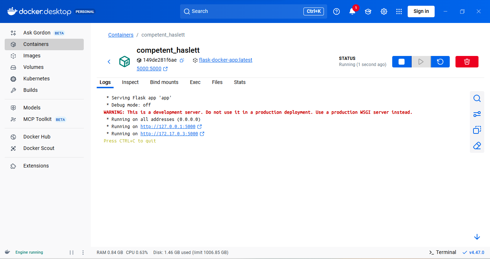
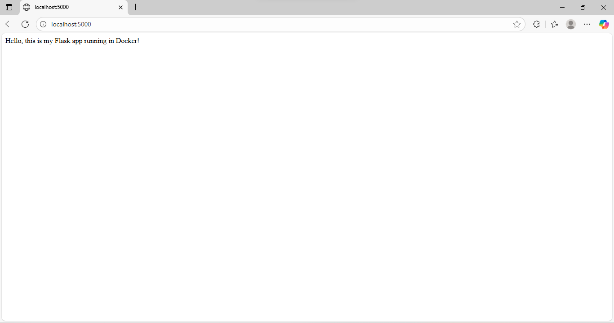
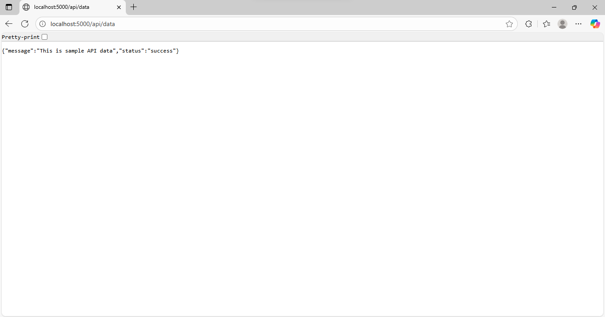

# Flask Docker App

 A simple Flask web application running inside a Docker container.  
 This project demonstrates web development skills with Flask and containerization using Docker.

## Features
- Simple Flask web app with a homepage
- Runs consistently in any environment using Docker
- Exposes port 5000 to access via browser

## How to Run

### Using Docker
1. Make sure Docker Desktop is installed and running.
2. Navigate to the project folder:
   ```bash
   cd flask_docker_app
   ```

3. Build the Docker image:
   ```bash
   docker build -t flask-docker-app .
   ```
 
4. Run the container:
   ```bash
   docker run -p 5000:5000 flask-docker-app
   ```

```
5. Open your browser and go to:
http://localhost:5000
```


---
## Screenshots

  



## Skills Demonstrated
- Python programming
- Flask web development (routes, request handling)
- Docker containerization
- Project structuring for professional repositories


